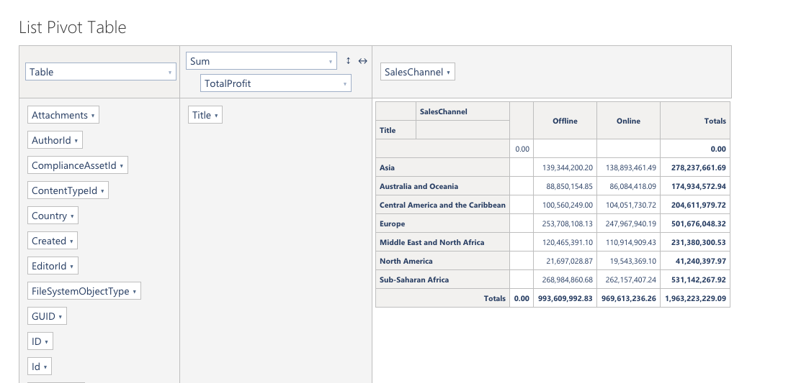
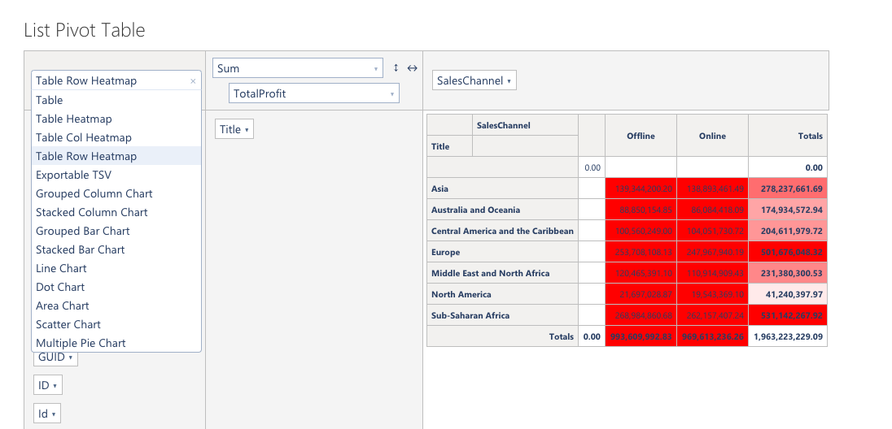
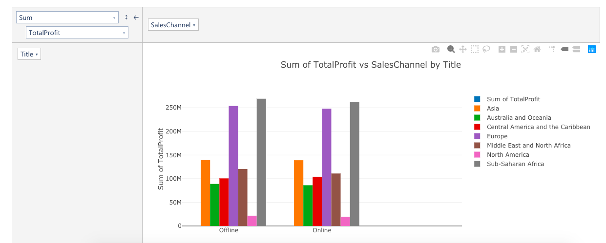
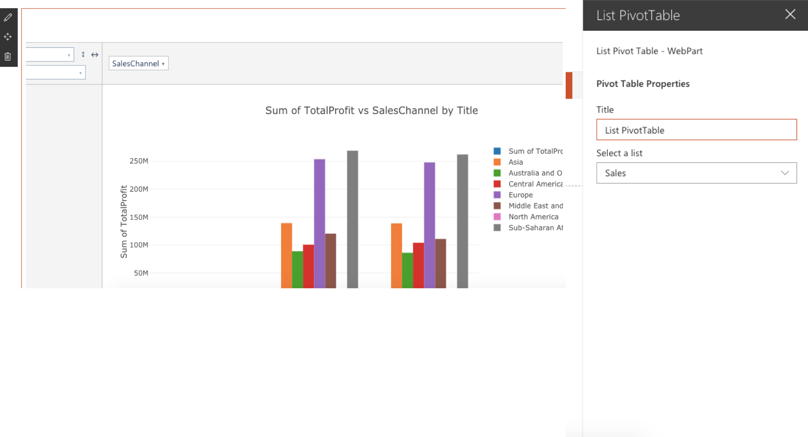

# React List PivotTable Web Part

## Summary

This WebPart allows you to do various types of data analysis, including charts. The WebPart uses a component based on pivottable.js

The configuration data of the Pivot Table is saved with the WebPart properties, the entire process of updating this data is done in real time when a change occurs in the Pivot Table.  

## Used SharePoint Framework Version 

## Applies to

* [SharePoint Framework](https:/dev.office.com/sharepoint)
* [Office 365 tenant](https://dev.office.com/sharepoint/docs/spfx/set-up-your-development-environment)

> Update accordingly as needed.

## Prerequisites
 
None
 
## Solution

Solution|Author(s)
--------|---------
react List PivotTable|João Mendes

## Version history

Version|Date|Comments
-------|----|--------
1.0.0|Fevereiro 5, 2019|Initial release

## Disclaimer
**THIS CODE IS PROVIDED *AS IS* WITHOUT WARRANTY OF ANY KIND, EITHER EXPRESS OR IMPLIED, INCLUDING ANY IMPLIED WARRANTIES OF FITNESS FOR A PARTICULAR PURPOSE, MERCHANTABILITY, OR NON-INFRINGEMENT.**

---

## Minimal Path to Awesome

- Clone this repository
- in the command line run:
  - `npm install`
  - `gulp build`
  - `gulp bundle --ship`
  - `gulp package-solution --ship`

 

## Features
This project contains sample Birthday web parts built on the SharePoint Framework using React
and an Azure Function to get user Birthdays from AAD.
This sample illustrates the following concepts on top of the SharePoint Framework:
- using React for building SharePoint Framework client-side web parts
- using React components for building Birthday web part
- using MSGraph API to get data from SharePoint Lists 
- using MSGraph API to read users from AAD
- using @PnP/PnPjs to create a List, add, update, delete Items.
 

